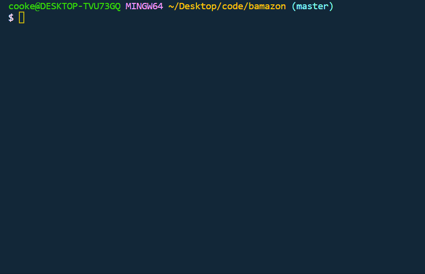

# bamazon
Homework: (B)amazon node/mySQL database Application

#

# Contributors
*@cookecn

#

# Technology
*Node, mySQL

#

# Github Links to projects:

* https://cookecn.github.io/updatedPortfolio/

#

# Step-by-Step!

1. Load in to mySQL database with the following credentials:
  1. host: "localhost"
  2. port: "3306"
  3. Username: "root"
  4. Password: "whatever you want"
2. Now, create a database named "bamazon"
3. CREATE DATABASE bamazon;
4. CREATE TABLE products (
	ItemId INTEGER NOT NULL AUTO_INCREMENT,
    ProductName VARCHAR(100),
    DepartmentName VARCHAR(100),
    Price INTEGER NOT NULL,
    StockQuantity INTEGER NOT NULL,
    PRIMARY KEY (ItemId)
);
5. Hit the lightning bolt in the left panel of the box.
6. Then say "USE bamazon;"
7. INSERT INTO products (ProductName, DepartmentName, Price, StockQuantity)
VALUES ("Football", "Sports", 30, 100),
("Face Wash", "Beauty", 24, 175),
("Phone Case", "Accessories", 20, 75),
("Television", "Electronics", 200, 35),
("Skyrim", "Gaming", 60, 200),
("Shoes", "Clothing", 75, 350),
("Shirt", "Clothing", 20, 800),
("Lawn Mower", "Outdoors", 450, 25),
("Avengers", "Movies", 20, 65),
("Crepe Pan", "Kitchen", 50, 98);

7. Hit the lightning bolt again after highlighting the last two sections.

#

#Video for help!

#

 1. To begin, open your console inside Visual Studio Code with (CTRL + ALT + `).
 2. After the console appears, you will be able to start your search by starting with "node".
 3. After you type node, type in "bamazonCustomer.js" (case-sensitive), so that the node console knows to use the bamazonCustomer.js file. 
 4. Hit enter, and a table should appear.
 5. You will be prompted what ID of the item is that you would like to buy. Input your item id and hit enter.
 6. Now you will be asked how many of that item you would like to buy. Input your item amount and hit enter. 
 7. The amount of items that you selected, as well as the total price will appear below.

#

#

# About

# Contributions
* As of now, this repository should only be changed/altered via Vanderbilt University professors and TA's from the bootcamp.

# Contact
* e-mail: colby.n.cooke@vanderbilt.edu
* LinkedIN: https://www.linkedin.com/in/colby-cooke-17676590/
* GitHub: https://github.com/cookecn
